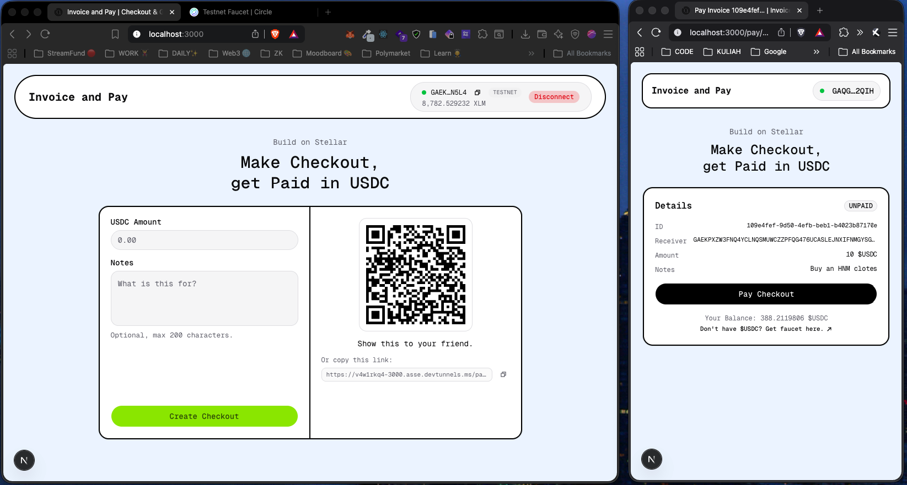
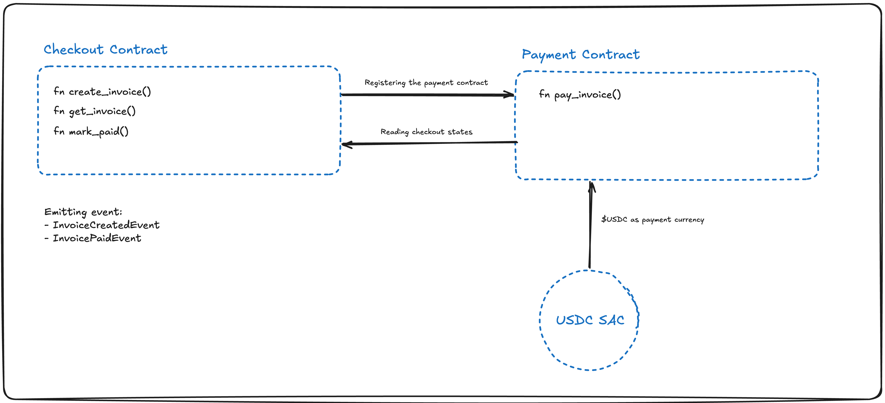

# Invoice and Pay

**Invoice and Pay** is a simple, no-account-required checkout app built on **Stellar**. A merchant fills in an amount and a note, gets a shareable link + QR, and the payer settles in **USDC** on testnet. Two small Soroban contracts handle the invoice lifecycle and the on-chain payment — the frontend just drives them.

The tagline says it all: _Make Checkout, get Paid in USDC._



---

## Deployment Summary

| Component             | Details                                                                                                             |
| --------------------- | ------------------------------------------------------------------------------------------------------------------- |
| **Website**           | Next.js 16 app (App Router) — `app/` for the home & `/pay/[id]` routes, Tailwind + shadcn/ui                        |
| **Checkout Contract** | Soroban contract at `contract/contracts/checkout` — owns invoices, emits `InvoiceCreatedEvent` / `InvoicePaidEvent` |
| **Payment Contract**  | Soroban contract at `contract/contracts/payment` — pulls USDC via SAC, calls `mark_paid` on checkout                |

Both contracts are built with `stellar contract build` (see `contract/contracts/{checkout,payment}/Makefile`) and deployed to Stellar **Testnet**. The payment contract address is passed into the checkout contract's constructor and pinned as the only authorized caller of `mark_paid`.

---

## High Level Architecture



The system is split into two Soroban contracts that talk to each other, plus the Stellar USDC Stellar Asset Contract (SAC) for the actual token movement:

- **Checkout Contract** — `create_invoice`, `get_invoice`, `mark_paid`. Holds the invoice state and is the source of truth for "paid or not". Emits `InvoiceCreatedEvent` and `InvoicePaidEvent`.
- **Payment Contract** — `pay_invoice`. The single entry point for paying. It cross-calls `get_invoice` on checkout, transfers USDC from payer to receiver, then cross-calls `mark_paid`.
- **USDC SAC** — the Stellar Asset Contract for USDC on testnet. Payment invokes it via the standard `token::Client` to move funds.
- **Registration flow** — at deploy time, checkout receives the payment contract address in its constructor and stores it. Every `mark_paid` call must pass an address that matches that stored value, so only the real payment contract can flip invoices to paid. No handshake, no re-entry.

In short: **checkout owns state, payment owns the USDC move, the SAC owns the token, and the registration is a one-time address pin at deploy.**

---

## How to Setup

### 1. Install frontend dependencies

```bash
pnpm install
```

### 2. Copy `.env.example` and fill `.env`

```bash
cp .env.example .env
```

Then edit `.env`:

- `NEXT_PUBLIC_WALLETCONNECT_PROJECT_ID` — your WalletConnect Cloud project ID (used by the Stellar wallets kit).
- `NEXT_PUBLIC_STELLAR_NETWORK` — `TESTNET` or `PUBLIC`.
- `NEXT_PUBLIC_APP_URL` — the public URL the app is served from (used for OG / canonical metadata).

### 3. Build and deploy the contracts

Build the WASM artifacts:

```bash
cd contract/contracts/checkout && stellar contract build
cd ../payment && stellar contract build
```

Deploy the **payment** contract first (you need its address to pass into checkout):

```bash
stellar contract deploy \
  --wasm target/wasm32v1-none/release/payment.wasm \
  --source <YOUR_STELLAR_SECRET_KEY> \
  --network testnet
```

Then deploy the **checkout** contract, passing the payment contract address as the constructor arg:

```bash
stellar contract deploy \
  --wasm target/wasm32v1-none/release/checkout.wasm \
  --source <YOUR_STELLAR_SECRET_KEY> \
  --network testnet \
  -- \
  --payment_contract <PAYMENT_CONTRACT_ADDRESS>
```

Wire the two deployed addresses into the frontend (the `lib/contract/{checkout,payment}.ts` modules).

### 4. Run the app

```bash
pnpm dev
```

Open [http://localhost:3000](http://localhost:3000) to create an invoice, or `/pay/<invoice-id>` to settle one. Make sure your wallet is funded with testnet USDC before paying.
